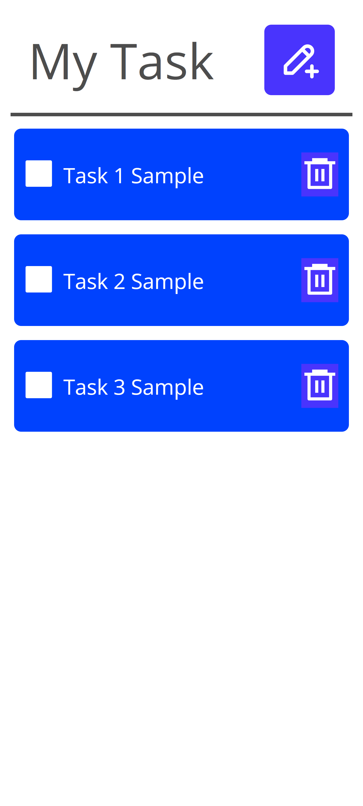
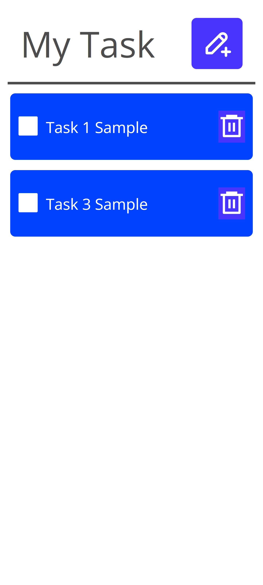

# React Task App

- This is a small React task app that uses state and the useState hook to create and delete tasks.

# Features

- Add new tasks
- Delete existing tasks
- State management using React hooks

# Technologies Used

- React
- JavaScript
- CSS

# Preview

### Create Tasks

### Delete Tasks

